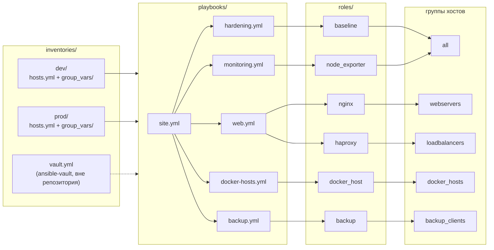

# ansible-infra

Набор production-ролей Ansible, который приводит парк серверов Debian/Ubuntu и
RHEL-семейства к одному описанному состоянию: hardening по CIS, Docker, nginx,
HAProxy, node_exporter и резервные копии на restic.

---

## Задача

Классическая история: сервер настроили руками, он работает, а как именно —
знает один человек, и то не полностью. Дальше происходит одно из трёх.

* **Снежинки.** Два «одинаковых» веб-сервера отличаются версией TLS-протокола,
  лимитом на размер тела запроса и тем, что на одном из них ротация логов
  сломалась полгода назад.
* **Дрейф.** Кто-то поправил `sshd_config` на проде «на пять минут», и это
  осталось. Ни одна проверка об этом не узнает, пока не придёт аудит.
* **Нулевая воспроизводимость.** Сервер умер — восстановление занимает день,
  потому что его конфигурация нигде не записана.

Репозиторий закрывает это тремя вещами:

1. **Конфигурация — код.** Всё состояние хоста описано в переменных инвентаря,
   а не в чьей-то голове.
2. **Идемпотентность доказывается, а не декларируется.** У каждой роли есть
   molecule-сценарий с шагом `idempotence`: второй прогон обязан не изменить
   ни одного ресурса, иначе CI красный.
3. **Проверяется поведение, а не факт записи файла.** `verify.yml` спрашивает
   `sshd -T`, ходит по HTTPS, поднимает контейнер, восстанавливает бэкап и
   сравнивает контрольную сумму — а не читает обратно тот же шаблон, который
   сам же и положил.

---

## Каталог ролей

| Роль | Что делает | Ключевые переменные |
|---|---|---|
| [`baseline`](roles/baseline) | Hardening по мотивам CIS: sshd (drop-in, современные Ciphers/KEX/MAC), sysctl, auditd, парольная политика, unattended-upgrades / dnf-automatic, лимиты journald, chrony, баннеры, blacklist ФС-модулей | `baseline_manage_*` (10 переключателей), `baseline_sshd_ciphers`, `baseline_sysctl_settings`, `baseline_auditd_watch_files`, `baseline_login_defs`, `baseline_pwquality` |
| [`docker_host`](roles/docker_host) | Upstream-репозиторий Docker, движок, `daemon.json` (ротация логов, live-restore, userland-proxy, address pools), членство в группе `docker`, systemd-таймер prune | `docker_host_daemon_config`, `docker_host_daemon_config_extra`, `docker_host_users`, `docker_host_prune_until` |
| [`nginx`](roles/nginx) | Полностью управляемый `nginx.conf`, TLS 1.2/1.3 с AEAD-шифрами, security-заголовки, зоны rate-limit, vhost-ы из списка переменных, проверка конфигурации перед reload | `nginx_vhosts`, `nginx_ssl_ciphers`, `nginx_security_headers`, `nginx_limit_req_zones` |
| [`haproxy`](roles/haproxy) | Frontend/backend из переменных, health-check в современном синтаксисе, TLS-терминация, runtime admin socket, stats + встроенный Prometheus-экспортёр | `haproxy_frontends`, `haproxy_backends`, `haproxy_ssl_bind_ciphers`, `haproxy_stats_*` |
| [`node_exporter`](roles/node_exporter) | Версионированный бинарник с проверкой SHA-256, системный аккаунт без логина, жёстко песочненный systemd-юнит, каталог textfile-коллектора | `node_exporter_version`, `node_exporter_checksums`, `node_exporter_listen_address`, `node_exporter_protect_system` |
| [`backup`](roles/backup) | restic: инициализация репозитория, обёртка с pre/post-хуками и healthcheck-пингом, systemd-таймер, retention с prune, периодическая проверка целостности, logrotate | `backup_repository`, `backup_password`, `backup_paths`, `backup_retention`, `backup_healthcheck_url` |

---

## Архитектура



`site.yml` выполняет плейбуки в осмысленном порядке: сначала hardening (чтобы
свежий хост был закрыт до того, как на нём что-то начнёт слушать порт), в
конце — экспортёр метрик (чтобы он поднялся на хосте в финальном состоянии).

Веб-уровень и балансировщики катятся `serial: 1` с `any_errors_fatal: true` —
одна нода за раз, остановка на первой ошибке. Hardening идёт `serial: "25%"`:
изменение, ломающее sshd, не должно отрезать весь парк одновременно.

---

## Решения и компромиссы

### Роли, а не один большой плейбук

Плейбук на 800 строк с `when: inventory_hostname in groups['web']` читается
линейно, но не переиспользуется и не тестируется. Роль — единица, у которой
есть контракт (`defaults/main.yml`), документация (`README.md`) и собственный
тест (`molecule/`). Цена: шесть каталогов вместо одного файла и необходимость
держать префиксы переменных (`nginx_*`, `baseline_*`) — что, впрочем,
проверяет `ansible-lint` правилом `var-naming[no-role-prefix]`.

Внутри роли `tasks/main.yml` — это только диспетчер: `include_tasks` по
логическим блокам с тегами. Никакой роли не нужно 300 строк в одном файле;
`baseline` разложен на десять блоков, каждый со своим переключателем
`baseline_manage_*`, чтобы группа хостов могла отказаться от одного контроля,
не форкая роль.

### Идемпотентность: доказывается шагом molecule, а не обещанием в README

`molecule test` включает шаг `idempotence`: тот же `converge.yml` запускается
второй раз, и molecule падает, если хоть одна задача сообщила `changed`. Это
единственный способ поймать классику вроде `command`, у которой забыли
`changed_when`, `lineinfile` с регуляркой, не совпадающей с тем, что она сама
только что записала, или шаблон, рендерящий словарь без `dictsort` (порядок
ключей Python стабилен, но зависимость от него — мина).

Что это ловит на практике, из этого репозитория:

* `restic` распаковывается в **версионированный** путь. Наивное
  `bunzip2 > /usr/local/bin/restic` с `creates:` на целевом файле не заметило
  бы смены `backup_restic_version` — обновление молча не произошло бы.
* `docker system prune` в таймере, а не в задаче Ansible: любая задача, которая
  «что-то чистит» при каждом прогоне, ломает idempotence и врёт про состояние.

Чего шаг `idempotence` **не** ловит: дрейф, возникший между прогонами
Ansible. Здесь помогает регулярный `--check` (см. ниже) или запуск по
расписанию.

### Покрытие CIS: что сделано и что сознательно не сделано

Сделано:

| Область | Что именно |
|---|---|
| SSH | drop-in вместо переписывания `sshd_config`, root-логин запрещён, парольная аутентификация отключена, `MaxAuthTries`, `LoginGraceTime`, ETM-only MAC, отсутствие CBC и SHA-1, баннер |
| Ядро и сеть | 33 ключа sysctl: редиректы, source routing, rp_filter, syncookies, ASLR, `kptr_restrict`, `dmesg_restrict`, `yama.ptrace_scope`, `protected_*` |
| Аудит | `auditd` с ротацией, watch-правила на identity/privilege/sshd, syscall-правила на b32 и b64, опциональный `-e 2` |
| Пароли | `login.defs`, `pwquality` (minlen 14, 4 класса), `INACTIVE=30`, umask 027 |
| Обновления | unattended-upgrades / dnf-automatic, только security-канал, разброс по времени |
| Логи | жёсткий потолок journald — журнал не должен уронить хост, заполнив `/var` |
| Модули ФС | `blacklist` + `install ... /bin/true` для cramfs, hfs, squashfs, udf, usb-storage |

Сознательно **не** сделано:

* **Разделы `/tmp`, `/var`, `/home` с `nodev,nosuid,noexec`.** Это решение
  уровня разметки диска, а не post-provisioning. Роль, которая перемонтирует
  `/var` на живом хосте, — это способ его потерять. Место такому контролю — в
  образе или в kickstart/preseed.
* **`pam_pwhistory` / `remember=N`.** Правка PAM-стека `common-password` или
  `system-auth` через `lineinfile` — самый быстрый способ сделать хост, на
  который нельзя залогиниться. Корректно это делается через `authselect` на
  RHEL и `pam-auth-update` на Debian, и это отдельная роль с отдельным риском.
* **Выгрузка уже загруженных модулей ФС.** `modprobe -r` на используемом модуле
  падает, а на неиспользуемом не даёт ничего сверх того, что уже даёт blacklist
  до следующей загрузки.
* **Firewall.** nftables/firewalld — это топология сети, а не hardening
  отдельного хоста; правила зависят от того, что стоит перед хостом. Роль
  `node_exporter` поэтому по умолчанию слушает loopback, а не «0.0.0.0 плюс
  надеемся на firewall».
* **AIDE, SELinux в enforcing, auditd `-e 2` по умолчанию.** Первые два меняют
  эксплуатационную модель целиком; третий заблокирован в `prod`-инвентаре, но
  не в дефолтах роли, потому что на хосте, где правила ещё настраивают, он
  превращает каждую правку в перезагрузку.

### Handlers против немедленного рестарта

Правило простое: **изменение файла уведомляет handler, никогда не рестартует
сервис прямо в задаче.** Handler выполняется один раз в конце, даже если его
уведомили пять задач — иначе nginx перезагружался бы по разу на каждый vhost.

Три места, где этого недостаточно, и что там сделано:

1. **nginx.** Handler-ов два, и порядок их выполнения определяется порядком
   объявления, а не порядком уведомления. Сначала `Validate nginx
   configuration` (`nginx -t`), затем `Reload nginx`. Если конфигурация
   сломана, play падает **до** reload, и работающий процесс продолжает
   обслуживать прошлую конфигурацию.
2. **auditd.** На RHEL юнит объявлен с `RefuseManualStop=yes`, и
   `systemctl restart auditd` возвращает «Operation refused». Единственный
   поддерживаемый вендором путь — SysV-обёртка `service auditd restart`. Это
   тот редкий случай, когда `command` вместо модуля оправдан, и он помечен
   `# noqa: command-instead-of-module` с объяснением прямо над строкой.
3. **sysctl.** Здесь handler-ов нет вообще, потому что шаблон — неверный
   инструмент: отрендеренный файл гарантирует значение только на следующей
   загрузке. `ansible.posix.sysctl` пишет тот же файл **и** проталкивает
   значение в работающее ядро, поэтому хост, у которого значение поменяли
   руками, сходится без перезагрузки.

### Валидация конфигов: три разных случая

| Случай | Как проверяется | Почему так |
|---|---|---|
| HAProxy | `validate: haproxy -c -f %s` на шаблоне | Вся конфигурация в одном файле — валидатор видит ровно то, что будет установлено, включая пути к сертификатам и синтаксис ACL. Сломанное изменение не попадает в `/etc/haproxy` вообще |
| sshd | `validate: sshd -t -f %s` на drop-in | Фрагмент валиден сам по себе, потому что у sshd плоский формат. Именно это не даёт выкинуть оператора с хоста |
| nginx | `nginx -t -c %s` для `nginx.conf` + отдельный проход по всему дереву после рендера vhost-ов | Фрагмент vhost-а нельзя проверить в изоляции: у него нет объемлющего блока `http`. Компромисс: сломанный фрагмент **остаётся на диске**, но play падает, а работающий nginx не получает reload. CD останавливается, оператор чинит |
| logrotate | `validate: logrotate --debug %s` | logrotate при одном сломанном файле отказывается работать целиком — то есть тихо перестаёт ротировать вообще все логи хоста |
| обёртка бэкапа | `validate: bash -n %s` | Синтаксическая ошибка в скрипте, который запускается раз в сутки в 02:30, обнаруживается через сутки |

`daemon.json` не валидируется JSON-парсером, потому что он не рендерится как
текст: шаблон сериализует словарь через `to_nice_json`, и синтаксически
невалидный JSON оттуда получить нельзя в принципе. `dockerd --validate` ловит
другой класс ошибок — неизвестные ключи.

### `check_mode` и его границы

Все роли проходят `--check --diff` на **сошедшемся** хосте: это рабочий способ
увидеть дрейф — что именно поменялось на хосте с прошлого прогона.

Границы, которые честнее назвать, чем замалчивать:

* На хосте, где роль **никогда не применялась**, `--check` неинформативен.
  `nginx -v` нельзя выполнить, пока пакет не установлен; `restic version`
  нельзя прочитать, пока бинарник не скачан. Задачи, читающие состояние,
  которое создала бы предыдущая задача, в check-режиме либо падают, либо
  пропускаются.
* Задачи `command`/`shell`, помеченные `changed_when: false`, в check-режиме
  по умолчанию пропускаются. Там, где результат нужен для ветвления (версия
  nginx), стоит `check_mode: false` — то есть команда выполняется даже в
  dry-run. Это read-only команда, но формально dry-run перестаёт быть
  абсолютно «сухим», и это осознанный выбор.
* `nginx -t` по всему дереву в check-режиме пропускается: писать было нечего,
  проверять нечего.

### restic против borg против rsnapshot

| | restic | borg | rsnapshot |
|---|---|---|---|
| Дедупликация | да, content-defined chunking | да, лучше по плотности | нет, только hardlink-и |
| Шифрование | всегда, на клиенте | опционально | нет |
| Бэкенды | S3, B2, Azure, GCS, SFTP, REST, локальный | SSH с `borg` на **той стороне**, локальный | rsync поверх SSH |
| Восстановление одного файла | `restore --include` | `extract` | обычный `cp` |
| Формат | один статический бинарник | Python + C-расширения | Perl + rsync |

Выбран **restic**, потому что для парка из разнородных хостов решающими
оказались два свойства: репозиторий может лежать в S3-совместимом объектном
хранилище **без агента на стороне хранилища**, и клиент — один статический
бинарник, который ставится проверкой контрольной суммы и не тянет за собой
интерпретатор с зависимостями.

Чем пришлось заплатить: borg дедуплицирует плотнее и работает быстрее на
одном большом хосте; `restic prune` — операция дорогая и не выполняется
инкрементально так же дёшево. Поэтому `forget --prune` в обёртке идёт после
бэкапа, а не перед ним: сначала свежий снимок, потом уборка.

rsnapshot отпал сразу: без шифрования и дедупликации репозиторий на
недоверенном хранилище неприменим, а hardlink-и ломаются на любом бэкенде,
кроме локальной ФС.

Отдельное решение: `restic check --read-data-subset 5%` после каждого прогона.
Полный `--read-data` перекачивает весь репозиторий — платить за это ежедневно
незачем; 5% в сутки означает, что репозиторий полностью верифицируется за
три недели.

### Пиннинг версий с контрольными суммами против пакетов дистрибутива

Для `node_exporter` и `restic` бинарник качается с GitHub с проверкой SHA-256
из опубликованного `sha256sums.txt`. Для Docker, nginx и HAProxy используются
пакеты.

Логика деления:

* **Пакет дистрибутива** — когда нужны security-бэкпорты без участия человека
  (nginx, HAProxy) или когда апстрим сам содержит нормальный репозиторий с
  подписью (Docker). `signed_by=` в sources.list ограничивает ключ одним
  репозиторием, а не всем хостом.
* **Пиннинг с контрольной суммой** — когда пакет дистрибутива отстаёт на
  годы и это критично. В Debian 12 `prometheus-node-exporter` — это 1.5.0
  при апстриме 1.12; половина метрик, на которые рассчитаны дашборды, там
  просто отсутствует.

Цена пиннинга честная: обновление версии — это ручное изменение двух
переменных (версии и словаря контрольных сумм) и коммит. Без контрольной суммы
`get_url` превратился бы в «скачай что дадут» — поэтому роль **падает**, если
для архитектуры хоста нет опубликованной суммы, вместо того чтобы установить
непроверенные байты.

Обе роли распаковывают релиз в **версионированный** каталог и копируют
бинарник оттуда. Прошлая версия остаётся на диске: откат — изменение
переменной, а не повторная выкачка.

### Что ещё стоит отметить

* **Переменные inline-документированы в `defaults/main.yml`**, а не только в
  таблице README. Комментарий там объясняет *почему* значение такое: `icc:
  false` в `daemon.json`, `ssl_session_tickets off` (nginx не умеет ротировать
  ticket-ключи, значит tickets ломали бы forward secrecy),
  `limit_req_status 429` (дефолтные 503 мониторинг читает как «бэкенд лежит»).
* **`node_exporter` не включает коллектор `systemd`.** Он ходит в
  `/run/systemd/private`, что требует root и записываемого `/run` — то есть
  отказа от `ProtectSystem=strict` и пустого `CapabilityBoundingSet` ради
  горстки метрик о состоянии юнитов. Их дешевле отдать через textfile.
* **Секреты — только в Ansible Vault.** В репозитории лежит
  `vault.example.yml`; `vault.yml` в `.gitignore`. Пароль репозитория restic
  передаётся файлом (`RESTIC_PASSWORD_FILE`), а не переменной окружения — так
  он не появляется в выводе `ps` и в `Environment=` systemd-юнита.

---

## Быстрый старт

```bash
# 1. Инструменты (зафиксированные версии)
pip install -r requirements-dev.txt
make deps

# 2. Линтеры и синтаксис — то же, что гоняет CI
make lint
make syntax

# 3. Тесты ролей в контейнерах (нужен Docker)
make test                    # все шесть ролей
make molecule ROLE=nginx     # одна роль

# 4. Секреты
cp inventories/dev/group_vars/vault.example.yml inventories/dev/group_vars/vault.yml
ansible-vault encrypt inventories/dev/group_vars/vault.yml

# 5. Dry-run и применение
make check   INVENTORY=inventories/dev/hosts.yml
make deploy  INVENTORY=inventories/dev/hosts.yml
make deploy  INVENTORY=inventories/prod/hosts.yml PLAYBOOK=playbooks/web.yml LIMIT=web-01.example.com
```

`make help` печатает список целей.

Точечные прогоны по тегам:

```bash
make deploy TAGS=sshd          # только конфигурация sshd
make deploy TAGS=docker-config # только daemon.json и рестарт движка
make deploy TAGS=backup        # только роль backup
```

---

## Структура репозитория

```
ansible-infra/
├── ansible.cfg                  # inventory, кеш фактов, SSH-мультиплексирование
├── requirements.yml             # коллекции Galaxy
├── requirements-dev.txt         # ansible-core, линтеры, molecule — точные версии
├── Makefile                     # lint / syntax / test / check / deploy
├── .ansible-lint                # профиль production
├── .yamllint                    # общий стиль YAML, его же переиспользует ansible-lint
├── .github/workflows/ci.yml     # yamllint, ansible-lint, syntax-check, molecule matrix
├── inventories/
│   ├── dev/
│   │   ├── hosts.yml            # адреса только из RFC 5737
│   │   └── group_vars/          # all, webservers, loadbalancers, docker_hosts, backup_clients
│   └── prod/
│       ├── hosts.yml
│       └── group_vars/
├── playbooks/
│   ├── site.yml                 # импортирует остальные в нужном порядке
│   ├── hardening.yml            # baseline на all, serial 25%
│   ├── docker-hosts.yml         # docker_host на docker_hosts
│   ├── web.yml                  # nginx на webservers, haproxy на loadbalancers
│   ├── backup.yml               # backup на backup_clients
│   └── monitoring.yml           # node_exporter на all
└── roles/
    ├── baseline/
    ├── docker_host/
    ├── nginx/
    ├── haproxy/
    ├── node_exporter/
    └── backup/
```

Каждая роль устроена одинаково:

```
roles/<name>/
├── defaults/main.yml            # переменные с комментариями «почему»
├── vars/                        # константы и различия между семействами ОС
├── tasks/
│   ├── main.yml                 # диспетчер: include_tasks + теги
│   └── <block>.yml              # логические блоки
├── handlers/main.yml
├── templates/*.j2               # с заголовком ansible_managed
├── meta/main.yml                # galaxy_info, платформы, зависимости
├── README.md                    # таблица переменных и обоснования
└── molecule/default/
    ├── molecule.yml             # docker-драйвер, Debian 12 + Rocky 9
    ├── prepare.yml              # фикстуры: сертификаты, ключи хоста, каталоги
    ├── converge.yml
    └── verify.yml               # ansible.builtin.assert по реальному поведению
```

---

## Проверка качества

CI состоит из трёх job-ов:

| Job | Что делает |
|---|---|
| `lint` | `yamllint --strict .` и `ansible-lint` с профилем `production` |
| `syntax` | `ansible-playbook --syntax-check` для каждого плейбука на обоих инвентарях |
| `molecule` | matrix из шести ролей, каждая — `create → prepare → converge → idempotence → verify → destroy` на Debian 12 и Rocky 9 |

Версии GitHub Actions зафиксированы точными тегами, версии Python-инструментов
— в `requirements-dev.txt`. Профиль `production` в `ansible-lint` — самый
строгий из встроенных: он требует FQCN у всех модулей, префикс роли у всех
переменных, явные права у всех файлов и полные метаданные ролей.

Что проверяют `verify.yml`, а не «файл на месте»:

* `baseline` — `sshd -T` (эффективная конфигурация, а не файл), отсутствие
  CBC-шифров и не-ETM MAC-ов в выданном списке, значения sysctl из работающего
  ядра, права на каждый управляемый файл;
* `docker_host` — `docker info` (демон реально перечитал `daemon.json`),
  запуск контейнера, членство в группе из `getent`;
* `nginx` — живые HTTP/HTTPS-ответы: security-заголовки, редирект 308, HSTS,
  `openssl s_client -tls1_1` должен быть отвергнут, `-tls1_2` — принят;
* `haproxy` — `haproxy -c`, наличие admin-сокета, 401 на stats без пароля и
  список бэкендов с паролем, `haproxy_backend_up` в `/metrics`;
* `node_exporter` — sandbox читается из `systemctl show`, а не из шаблона;
  в textfile-каталог кладётся метрика и ищется в живом скрейпе;
* `backup` — юнит запускается, снимок создаётся, восстанавливается в отдельный
  каталог, и контрольная сумма восстановленного файла сравнивается с исходной;
  файл, созданный pre-хуком и удалённый post-хуком, должен быть **внутри**
  снимка и **отсутствовать** на диске.

---

## Лицензия

MIT — см. [LICENSE](LICENSE).
